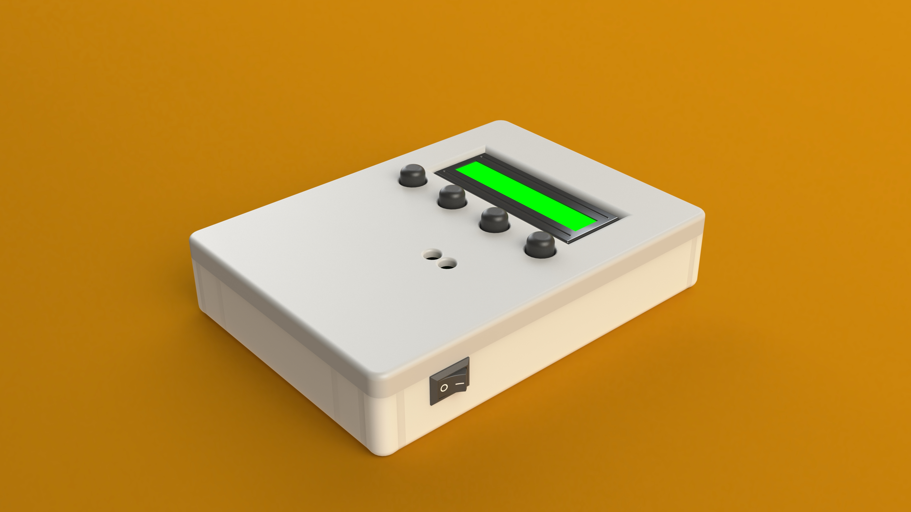
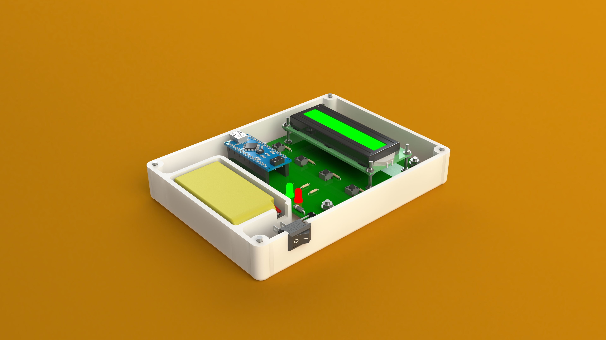
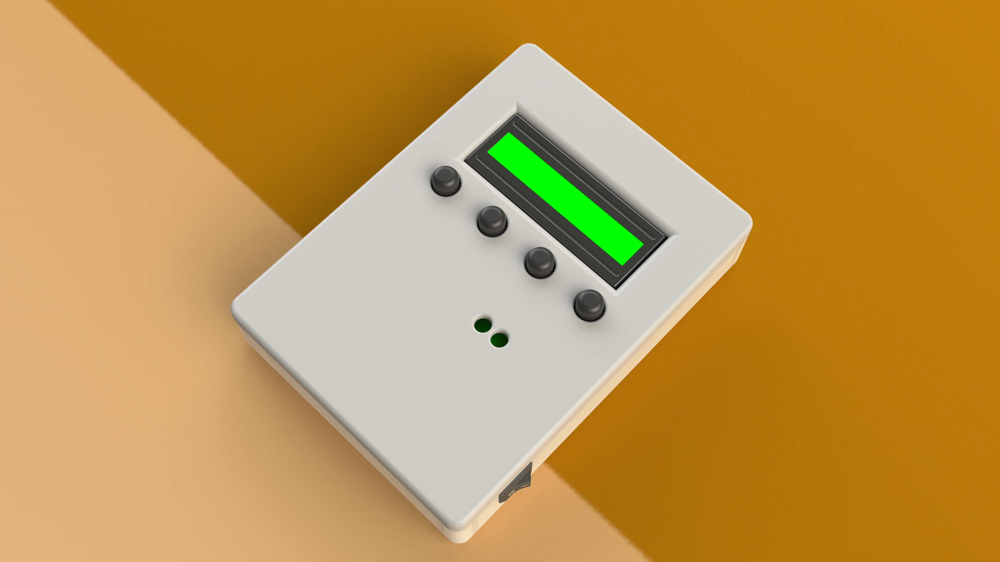
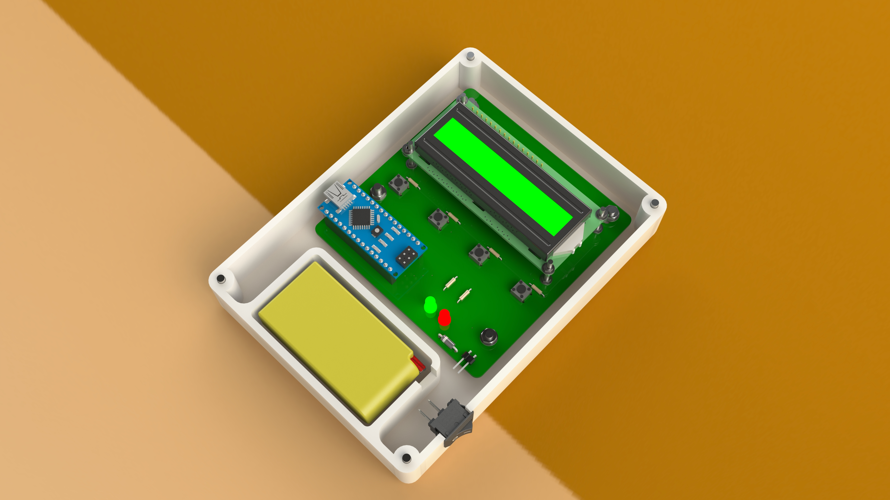
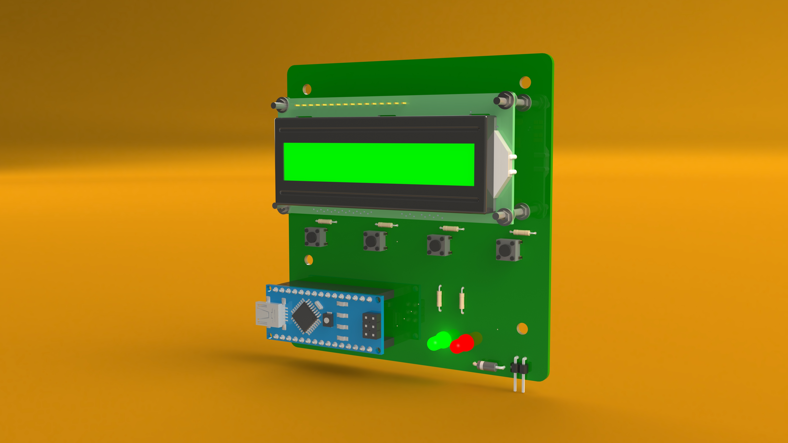

# GeradorSenhas 

Gerador de senhas aleatórias alfanuméricas, utilizando como todo o alfabeto, números de 0 a 9 e os seguintes caracteres especiais: "!", "@", "#", "$", "%", "&", ".", "-", "+".

Neste repositório é possível encontrar todos os arquivos para replicação do projeto, contendo os arquivos para impressão 3D.

## Prototipo
### Visão geral:

### PCB desenvolvida:

## Software utilizados
* [SolidWorks](https://www.solidworks.com/pt-br)    (Versão: 2020)
* [Eagle](https://www.autodesk.com.br/products/eagle/overview)         (Versão: 9.5.2)

## Lista de Materiais:
* 
* 
* 

## Licença
[Apache-2.0](https://choosealicense.com/licenses/apache-2.0/)
